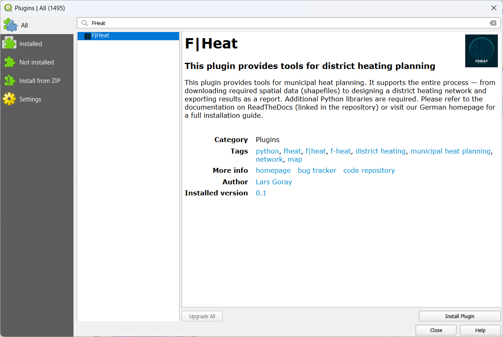

Installation
============
.. note::
    The instructions are currently aimed specifically at Windows users. There may be deviations for the installation on other operating systems, but corresponding instructions for these systems will be added here in the future. The application is currently tested for Python versions > 3.9 and QGIS version > 3.3.

.. attention::

   QGIS comes with its own Python environment. To install libraries there, QGIS must be started with administrator rights.

   If you don’t have admin rights, you can’t install packages directly into QGIS’s environment. Instead, you need a separate Python installation in your user account — **with the same Python version as QGIS** (e.g., Python 3.12). Packages will then be installed into this user environment, not into QGIS.

   Also note that when QGIS is started as an administrator, it may use a different user profile. This can cause plugins installed under your normal user account to be unavailable. However, libraries installed in QGIS’s Python environment are accessible to all users.

The installation process depends on whether you have administrator rights and want to install QGIS with ``F|Heat`` on your entire system, or whether you as a user only want to install ``F|Heat`` on your own user account. The individual steps are explained below so that you can follow the instructions according to your requirements.

QGIS Installation
-----------------

QGIS is a free open source geographic information system (GIS) used for the creation, analysis and visualization of spatial data. QGIS can be downloaded and installed from the official website `qgis.org <https://qgis.org/>`_. You usually need administrator rights to install QGIS - even if you only install the program in your user directory. If you have already installed QGIS, you can use your existing version and skip this step.

.. _Plugin-Installation:

Plugin Installation
-------------------

If you want to install ``F|Heat`` for all users as an administrator, start QGIS as an administrator. A new user profile may be loaded and your previous extensions and settings may not be displayed. However, installation is easiest in administrator mode, as you can easily use the ``F|Heat`` function to install the required libraries in the QGIS Python environment. As a different plugin directory is opened for each user, you must then install the plugin for each user (not in administrator mode) in QGIS. The libraries do not have to be installed again.

If you do not have administrator rights, start QGIS normally.

**Official extension from QGIS:**

.. figure:: images//readme/qs1.png
    :alt: qs1.png
    :width: 100 %
    :align: center

1. Click on "Plugins" > "Manage and Install Plugins..."

2. Select "All", search for "FHeat" and install the Plugin.

.. figure:: images//readme/qs3.png
    :alt: qs3.png
    :width: 100 %
    :align: center

3. If the plugin toolbar is not visible, right-click on an empty space in the toolbar and check the "Plugin Toolbar" box.

.. figure:: images//readme/qs4.png
    :alt: qs4.png
    :width: 100 %
    :align: center

4. The plugin toolbar with the F|Heat icon will then become visible.

**Install via zip-folder (development version):**

    * Extract the plugin from the current Github repository.
    * Install via the option `Install from zip-folder` instead of searching for FHeat in step 3.
    * Do not select the whole repository, only zip the `F-Heat_QGIS` folder and install it

.. _Package-Installation:

Install python packages
-----------------------

Once F|Heat is started the user is greeted with the Introduction tab. You will probably also initially see a message that some Python libraries are missing. These must now be installed.

You have several options for installing the required libraries. F|Heat offers automatic installation, although certain requirements must be met, which are explained below. Alternatively, the libraries can be installed manually via the OSGeo4W shell, which is added by default with QGIS. This usually requires administrator rights. Follow these instructions to install manually:
`Installing Python packages in QGIS 3 (for Windows) <https://landscapearchaeology.org/2018/installing-python-packages-in-qgis-3-for-windows/>`_

The required libraries are: geopandas, OWSLib, pandas, fiona, numpy, networkx, matplotlib, openpyxl, demandlib, workalendar

**Installing libraries as administrator**

If QGIS is run as administrator, you have write access to the Python directory that QGIS uses and automatically comes with the QGIS installation. You can simply use the function under the Introduction tab in F|Heat, which automatically installs the libraries. Once the "Install Packages" button is clicked, a terminal window will open and the installation will begin. If you receive an empty prompt and everything has been installed without error messages, you can close the window. The libraries are then available to all users on the computer.

**Installing libraries without administrator rights**

If QGIS is started without administrator rights, you do not have write access to the Python directory of QGIS. But you can still use the automatic install packages function of F|Heat if Python is installed in your user directory. However, the Python version must match the QGIS Python version.
You must therefore install the same Python version that is used by QGIS by default. You can view the Python version in QGIS under the Help > About QGIS menu or click on the Check QGIS Python version button under the Introduction tab in F|Heat. You will get e.g. 3.13.1. It is important for QGIS that the first two digits match. In this example, install version 3.13.x:

Go to `python.org <https://www.python.org/downloads/>`_ and download the matching version for your QGIS. Make sure to check the box for adding Python to PATH and uncheck the box for admin priviliges. For older versions, you may find the option for installation without admin priviliges under "Customize installation".

.. attention::
    Make sure to check the box for adding Python to PATH and uncheck admin priviliges.

    .. figure:: images/python_installation.png
        :alt: Python_to_path.png
        :width: 100 %
        :align: center

After installing Python, you may need to restart QGIS so that the new path is found by QGIS. You can then use the function under the Introduction tab in F|Heat. As soon as the "Install Packages" button is clicked, a terminal window opens and the installation begins. You will be informed that the packages will be loaded into the “User Installation”, as there are no write permissions for the QGIS Python environment. If you receive an empty prompt and everything has been installed without error messages, you can close the window.
